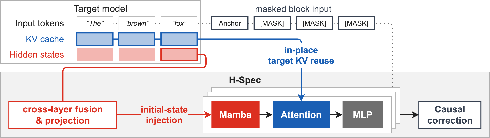

# H-Spec: Parallel Speculative Decoding Without a Drafter-Side KV Cache

Code implementation for H-Spec, a parallel speculative drafter that operates without storing a separate drafter-side KV cache in GPU memory. H-Spec uses two complementary sources of target-model information: the hidden states only at the last input position, and existing target KV caches.



[Link to arXiv preprint](https://arxiv.org/abs/2609.24197)

## Usage

Our implementation is based on Speculators commit #3251ed0 and vLLM v0.25.1. We currently provide git patches to those upstreams. Official Speculators/vLLM integration is in-progress. Note that H-Spec uses the internal name `mamba_attn_hybrid` in the code.

### Setup

`apply.sh` downloads both projects at the versions above, applies our patches, and installs everything into `.venv`:

```bash
git clone https://github.com/weifanjiang/H-Spec
cd H-Spec
./apply.sh
```

Add `SKIP_MAMBA=1` if you only want to run a model rather than train one. It skips two kernels that take a long time to build and need the CUDA toolkit.

### Running a model

Use vLLM to serve the target model and corresponding H-Spec checkpoint.

```bash
VLLM_USE_V2_MODEL_RUNNER=1 python -m vllm.entrypoints.openai.api_server \
    --model Qwen/Qwen3-8B \
    --speculative-config '{"model": "PATH_TO_HSPEC_CHECKPOINT",
                           "method": "mamba_attn_hybrid",
                           "num_speculative_tokens": 7,
                           "enable_kv_sharing": true}'
```

### Training

Training needs four GPUs: two serve the target model for generating KV cache and hidden states, two train the drafter.

Step 1: start vLLM server for target model.

```bash
cd speculators
CUDA_VISIBLE_DEVICES=0,1 python scripts/launch_vllm_nkv.py Qwen/Qwen3-8B \
    --hidden-states-path PATH_FOR_SCRATCH_FILES \
    --attn-kv-layer-ids 17 25 34 \
    --latent-fusion-layer-ids 1 9 17 25 34 \
    -- --port 8000 --tensor-parallel-size 2
```

Step 2: start trainer in a separate terminal.

```bash
cd speculators
CUDA_VISIBLE_DEVICES=2,3 torchrun --standalone --nproc_per_node=2 scripts/train.py \
    --verifier-name-or-path Qwen/Qwen3-8B \
    --data-path PATH_TO_TRAINING_DATA \
    --hidden-states-path PATH_FOR_SCRATCH_FILES \
    --on-missing generate --on-generate delete \
    --vllm-endpoint http://localhost:8000/v1 \
    --speculator-type mamba_attn_hybrid \
    --block-pattern mamba mlp mamba attention mlp mamba attention mlp mamba attention mlp \
    --attn-kv-layer-ids 17 25 34 \
    --latent-fusion-layer-ids 1 9 17 25 34 \
    --mamba-seed-mode shared \
    --mamba-num-heads 48 --mamba-head-dim 64 --mamba-d-state 4 --mamba-n-groups 4 \
    --trainable-q-proj --trainable-kv-proj \
    --sliding-window 2048 --sliding-window-indices 0 1 2 \
    --draft-vocab-size 32000 --max-anchors 3072 --block-size 8 \
    --scheduler-type cosine --lr 0.0006 --epochs 5 --noise-std 0.0 \
    --loss-fn '{"ce": 0.1, "tv": 0.9}' \
    --parallel-drafting-loss-weight dflash \
    --markov-rank 256 --enable-confidence-head \
    --confidence-head-with-markov --confidence-head-alpha 1.0 \
    --run-name qwen3-8b-draft \
    --save-path PATH_TO_CHECKPOINTS
```

## Checkpoints

We release all H-Spec and baseline checkpoints used in the preprint's evaluation. These were trained under a unified recipe, on 100K samples drawn from Magpie and Ultrachat.

[Link to HuggingFace collection.](https://huggingface.co/collections/weifanjiang/h-spec-6abac1b6b1e283d9e3cb0522)

| Target model | H-Spec | DSpark | DFlash | P-EAGLE |
|---|---|---|---|---|
| Qwen3-8B | [Link](https://huggingface.co/weifanjiang/qwen3-8b.speculators.hspec) | [Link](https://huggingface.co/weifanjiang/qwen3-8b.speculators.dspark) | [Link](https://huggingface.co/weifanjiang/qwen3-8b.speculators.dflash) | [Link](https://huggingface.co/weifanjiang/qwen3-8b.speculators.peagle) |
| Qwen3-4B | [Link](https://huggingface.co/weifanjiang/qwen3-4b.speculators.hspec) | [Link](https://huggingface.co/weifanjiang/qwen3-4b.speculators.dspark) | [Link](https://huggingface.co/weifanjiang/qwen3-4b.speculators.dflash) | [Link](https://huggingface.co/weifanjiang/qwen3-4b.speculators.peagle) |
| Llama-3.1-8B-Instruct | [Link](https://huggingface.co/weifanjiang/llama3.1-8b-it.speculators.hspec) | [Link](https://huggingface.co/weifanjiang/llama3.1-8b-it.speculators.dspark) | [Link](https://huggingface.co/weifanjiang/llama3.1-8b-it.speculators.dflash) | [Link](https://huggingface.co/weifanjiang/llama3.1-8b-it.speculators.peagle) |

Checkpoints are served with vLLM's `--speculative-config`, one `method` per column:

- **H-Spec** — `"method": "mamba_attn_hybrid"`, with `"enable_kv_sharing": true`, and `VLLM_USE_V2_MODEL_RUNNER=1` in the environment
- **DSpark** — `"method": "dspark"`
- **DFlash** — `"method": "dflash"`
- **P-EAGLE** — `"method": "eagle3"`, with `"parallel_drafting": true`

Checkpoints for additional target models and training recipes are in-progress.

## Citation

If you use H-Spec, please consider citing our work:
```
@misc{jiang2026hspecparallelspeculativedecoding,
      title={H-Spec: Parallel Speculative Decoding Without a Drafter-Side KV Cache}, 
      author={Weifan Jiang and Krishna Teja Chitty-Venkata and Megan Flynn and Reed Meyerson and Zhenting Qi and Tianyu Wu and Eldar Kurtic and Minlan Yu and Alexandre Marques},
      year={2026},
      eprint={2609.24197},
      archivePrefix={arXiv},
      primaryClass={cs.LG},
      url={https://arxiv.org/abs/2609.24197}, 
}
```
